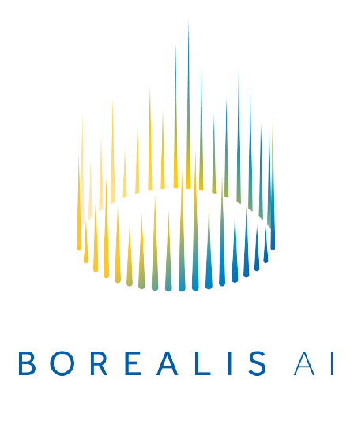

# KGFarm
<b>A Feature Discovery System for Data Science Across the Enterprise</b>
[🔗](https://www.overleaf.com/read/fwcvhtrxcqbh)
## 📐 System Design


## ⚡ Quick Start
1. Install dependencies
```bash
pip install -r requirements.txt
```
2. Connect to the [Stardog](https://www.stardog.com/) engine
```bash
stardog-admin server start
```
3. Run KGFarm's [<code>graph_builder</code>](feature_discovery/src/graph_builder/build.py):<br/>
generates [<code>Farm.ttl</code>](feature_discovery/src/graph_builder/Farm.ttl) and uploads it to the [stardog server](https://cloud.stardog.com/)

```bash
cd feature_discovery/src/graph_builder
python build.py -db Database
```
4. Start using KGFarm APIs (checkout [<code>KGFarm_notebook.ipynb</code>](KGFarm_notebook.ipynb))

## 🚧 Roadmap
- <b>List of deliverables for KGFarm v0.1</b> [🔗](https://docs.google.com/document/d/1wy0ZrcUx_d_HeQoy6WMa74KXf9hvv19DTN2wTY5xkOc/edit?usp=sharing)
* [X] Extract [Entities](https://docs.feast.dev/v/v0.6-branch/user-guide/entities) 
* [X] Predict [Feature views without Entities](https://docs.feast.dev/getting-started/concepts/feature-view#feature-views-without-entities)
* [X] Predict [Feature view](https://docs.feast.dev/getting-started/concepts/feature-view) with single [Entity](https://docs.feast.dev/v/v0.6-branch/user-guide/entities)
* [X] Predict [Feature view](https://docs.feast.dev/getting-started/concepts/feature-view) with multiple [Entities](https://docs.feast.dev/v/v0.6-branch/user-guide/entities)
* [X] Support for [Entity](https://docs.feast.dev/v/v0.6-branch/user-guide/entities) updation on the fly
* [X] Predict Features for [Dataset enrichment](https://docs.feast.dev/getting-started/quickstart#step-4-generating-training-data)
* [X] Automate Data cleaning 
* [X] Predict Feature transformations
* [X] Automate Feature selection
* [ ] Support Unseen datasets

## 📗 Useful resources
- [Feature discovery slides](https://docs.google.com/presentation/d/14JigzSty4pwJaTXSNbo-SYZBcSaTqanlC4ETbGJVbTU/edit?usp=sharing)
- [Research objectives](https://docs.google.com/document/d/1M_iWqk0YUscxXPl3UKJ0m83NAXdVOhVbUXnbKry4dSQ/edit?usp=sharing)
- [Mitacs proposal](https://docs.google.com/document/d/1fWrp-IS9ZkKcOavcGDTr3cYx05xQag-H-PuFApZn1AY/edit?usp=sharing)
- [KGFarm paper](https://www.overleaf.com/read/fwcvhtrxcqbh)

## 🦾 Contributors
<p float="left">
 
   

  
</p>
