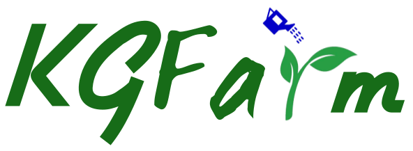

<p align="center">
    <a href="https://www.mitacs.ca/en/projects/feature-discovery-system-data-science-across-enterprise">
      
    </a>
</p>

### <b>KGFarm: A Feature Discovery System for Data Science Across the Enterprise</b> [🔗](https://www.overleaf.com/read/fwcvhtrxcqbh)
## 📐 System Design


<p align="justify">
Features are one of the essential ingredients for building a machine learning model. In the case of structured data, each feature
physically represented as a column serves as a measurable property that describes the characteristics of one or more entities. The
quality and quantity of these features significantly impact how
well a model fits on the data. In recent years there has been a reasonable interest in deploying feature stores across enterprises to
conserve and nurture the advantageous features over time. For a
given machine learning problem manual inspection of datasets for
extracting entities and their corresponding features is considerably
time-consuming and cumbersome. Moreover, for modeling purposes, data scientists spent the majority of their time going through
several steps within data preparation such as performing feature
enrichment, cleaning, transformation, selection, and more. Current
implementations of feature stores rely on the user to hard-code
the desired set of entities and features which becomes a bottleneck
as the volume of data tends to increase. Furthermore, present-day
systems that promise to solve the problem of data preparation provide limited functionalities and lack automation. To address these
problems in a holistic manner, we propose KGFarm, a platform for
feature discovery across an enterprise that discovers entities and
their respective features at scale with high confidence. KGFarm
employs a combined strategy that incorporates column statistics
and relationships across schema-less data sources to generate the
Farm graph capturing information concerning quality entities and
features. Additionally, to address the problem of data preparation
KGFarm learns from information that has been previously applied
by real data scientists. This allows KGFarm to discover features
and automate data preparation by learning and sharing knowledge
with respect to the features throughout the enterprise at scale.</p>

## ⚡ Quick Start
1. Install dependencies
```bash
pip install -r requirements.txt
```
2. Connect to the [Stardog](https://www.stardog.com/) engine
```bash
stardog-admin server start
```
3. Run KGFarm's [<code>graph_builder</code>](feature_discovery/src/graph_builder/build.py):<br/>
generates [<code>Farm.ttl</code>](feature_discovery/src/graph_builder/Farm.ttl) and uploads it to the [stardog server](https://cloud.stardog.com/)

```bash
cd feature_discovery/src/graph_builder
python build.py -db Databaseg
```
4. Start using KGFarm APIs (checkout [<code>KGFarm_demo.ipynb</code>](KGFarm_demo.ipynb))

## 🚧 Roadmap
- <b>List of deliverables for KGFarm v0.1</b> [🔗](https://docs.google.com/document/d/1wy0ZrcUx_d_HeQoy6WMa74KXf9hvv19DTN2wTY5xkOc/edit?usp=sharing)
* [X] Extract [Entities]() 
* [X] Predict [Feature views without Entities]()
* [X] Predict [Feature view with single Entity]()
* [X] Predict [Feature view with multiple Entities]()
* [X] Support [Entity updation]() on the fly
* [X] Predict Features for [Dataset enrichment]()
* [X] Predict [Feature value cleaning]()
* [X] Predict [Feature transformations]()
* [X] Automate [Feature selection]()
* [X] Support unprofiled datasets

## 📗 Useful resources
- [Feature discovery slides](https://docs.google.com/presentation/d/14JigzSty4pwJaTXSNbo-SYZBcSaTqanlC4ETbGJVbTU/edit?usp=sharing)
- [Research objectives](https://docs.google.com/document/d/1M_iWqk0YUscxXPl3UKJ0m83NAXdVOhVbUXnbKry4dSQ/edit?usp=sharing)
- [Mitacs proposal](https://docs.google.com/document/d/1fWrp-IS9ZkKcOavcGDTr3cYx05xQag-H-PuFApZn1AY/edit?usp=sharing)
- [KGFarm paper](https://www.overleaf.com/read/fwcvhtrxcqbh)

## 🦾 Contributors
<p float="left">
 
   

  
</p>
