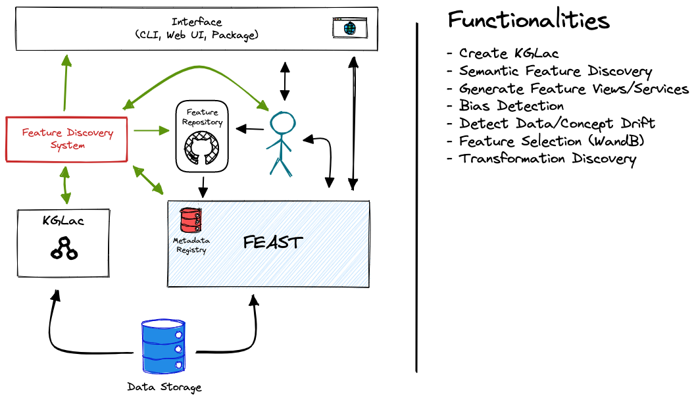

# KGFarm 
A Feature Discovery system for Machine learning workflows
## 📐 System Design


## ⚡ Quick Start
- Installing dependencies
```bash
pip install -r requirements.txt
```
- Setup feature repository using feast
```bash
feast init feature_repo
```
- Start using KGFarm APIs (checkout <code>notebook.ipynb</code>)
##🦾 Contributors
<p float="left">
 
   

  
</p>