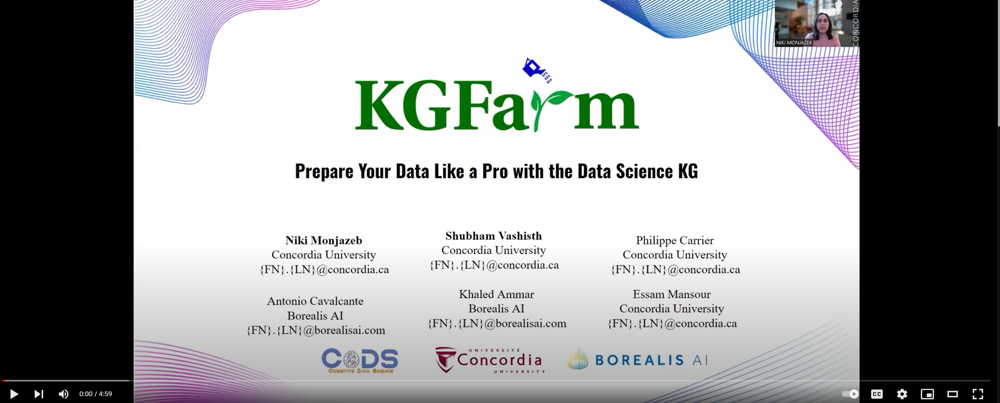

<p align="center">
    <a href="https://www.mitacs.ca/en/projects/feature-discovery-system-data-science-across-enterprise">
      
    </a>
</p>

### <p align="center"><b>A Holistic Platform for Automating Data Preparation</b></p>

<p align="center">
<a href="tests/test_apis.py"></a>
<a href="LICENSE"></a>
</p>

## 📐 System Design
<p align="center"></p>

<p align="justify">Data preparation and feature engineering are critical for improving model accuracy. However, data scientists often work independently and spend most of their time writing code for these steps without support for automatic learning from each other’s work. To address this challenge we developed KGFarm, a holistic platform automating data preparation and feature engineering based on machine learning models trained using the semantics of data science artifacts, including pipeline scripts applied to different datasets. We capture the semantics of these artifacts as a knowledge graph (KG). KGFarm provides seamless integration with existing data science platforms, enabling scientific communities to automatically discover and learn about each other’s work. We trained KGFarm’s models on top of a KG constructed from top-rated 1000 Kaggle datasets and 13800 pipeline scripts with the highest number of votes. KGFarm is tested on <a href="experiments/benchmark/README.md">130 unseen datasets</a> collected from different AutoML benchmarks to compare KGFarm against the state-of-the-art (SOTA) systems in data cleaning, transformation, and feature engineering. Our <a href="experiments/README.md">experiments</a> show that KGFarm consumes significantly less time and memory w.r.t the SOTA systems while achieving comparable or better accuracy than them. </p>

<br>
<p align="center" style="margin-top: 50px"><b>Unleashing the power of Automated </b></p>


## ⚡ Quick Start

Try the sample <a href="https://colab.research.google.com/drive/1u4z4EKGd8G1ju61Q3sPk5fH9BrMp8IRM?usp=sharing"><span style="color: orange;">KGFarm Colab Notebook</span></a>  for a quick hands-on! 
Alternatively run [setup.py](helpers/setup.py) to setup the demo in a local environment!

1. Install dependencies
```bash
pip install -r requirements.txt
```
2. Connect to the [Stardog](https://www.stardog.com/) engine
```bash
stardog-admin server start
```
3. Run KGFarm's [<code>graph_builder</code>](feature_discovery/src/graph_builder/build.py):<br/>
for augmenting the [LiDS](https://github.com/CoDS-GCS/KGFarm/blob/645f12dfd63bae0bd319401c2cf10f8378dd6679/feature_discovery/src/graph_builder/farm.ttl) graph and uploading it to the [stardog](https://cloud.stardog.com/)

```bash
cd feature_discovery/src/graph_builder
python build.py -db Database_name
```
4. Start using KGFarm APIs (checkout this [use case](docs/KGFarm_full_demo.ipynb))

## 🚀 Functionalities

* [X] Automated Data Cleaning
* [X] Automated Data Transformation
* [X] Automated Feature Selection

## ⚙️ APIs & Library Interface
KGFarm APIs are designed to promote seamless integration with conventional ML workflows. For taking advantage of KGFarm with your data, checkout [KGFarm_tutorial.ipynb](docs/KGFarm_tutorial.ipynb).

## 🧪 Experiments 

We [evaluated](experiments/README.md) KGFarm to several state-of-the-art systems on [130 open datasets](experiments/benchmark/README.md). More information regarding our evaluations per task is available below:
1. [Data Transformation](experiments/results/data_transformation.pdf)
2. [Data Cleaning](experiments/results/data_cleaning.pdf)
3. [Feature Engineering](experiments/results/feature_engineering.pdf)

##  KGFarm Demo
<a href="https://rebrand.ly/kgfarm"></a>

## 🦾 Contributors
<p float="left">
  
  
</p>

