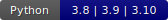

<p align="center">
    <a href="https://www.mitacs.ca/en/projects/feature-discovery-system-data-science-across-enterprise">
      
    </a>
</p>

### <p align="center"><b>A Holistic Platform for Automating Data Preparation</b></p>

<p align="center">
<a href="https://github.com/CoDS-GCS/KGFarm/actions"></a>
<a href="LICENSE"></a>
<a href="https://kgfarmworkspace.slack.com/archives/C05F4232NRG"></a>
<a href="requirements.txt"></a>
</p>

## 📐 System Design
<p align="center"></p>

<p align="justify">Data preparation is critical for improving model accuracy. However, data scientists often work independently and spend most of their time writing code for preparing data without support for automatic learning from each other’s work. To address this challenge we developed KGFarm, a holistic platform for automating data preparation using machine learning models trained on knowledge graph capturing the semantics of data science artifacts, including datasets and pipeline scripts. KGFarm provides seamless integration with existing data science platforms, enabling scientific communities to automatically discover and learn about each other’s work.</p>

<p align="center" style="margin-top: 50px"><b>Unleashing the power of Automated </b></p>

## ⚡ Quick Start

Try the sample <a href="https://colab.research.google.com/drive/1u4z4EKGd8G1ju61Q3sPk5fH9BrMp8IRM?usp=sharing"><span style="color: orange;">KGFarm Colab Notebook</span></a>  for a quick hands-on! 
Alternatively run [setup.py](helpers/setup.py) to setup the demo in a local environment!

1. Install [dependencies](requirements.txt)
```bash
pip install -r requirements.txt
```
2. Connect to the [Stardog](https://www.stardog.com/) engine
```bash
stardog-admin server start
```
3. Run KGFarm's KG Augmentor to augment the [LiDS](https://github.com/CoDS-GCS/KGFarm/blob/645f12dfd63bae0bd319401c2cf10f8378dd6679/feature_discovery/src/graph_builder/farm.ttl) graph* (for entity extraction and exploration)

```bash
python kg_augmentor/augment_LiDS.py -db Database_name
```
4. Start using KGFarm APIs (checkout this [use case](docs/KGFarm_full_demo.ipynb))

## 🚀 Functionalities

* [X] Automated Data Cleaning
* [X] Automated Data Transformation
* [X] Automated Feature Selection

## ⚙️ APIs & Library Interface
KGFarm APIs are designed to promote seamless integration with conventional ML workflows. For performing Data Preparation with KGFarm as human-in-the-loop, please refer to [KGFarm_tutorial.ipynb](docs/KGFarm_tutorial.ipynb). For full automation on profiled data try KGFarm's [Pipeline Generator](operations/pipeline_generator.py) (see the example below). 
<p align="center"></p>

[//]: # (## 🧪 Experiments )
[//]: # ()
[//]: # (We [evaluated]&#40;experiments/README.md&#41; KGFarm to several state-of-the-art systems on [130 open datasets]&#40;experiments/benchmark/README.md&#41;. More information regarding our evaluations per task is available below:)

[//]: # (1. [Data Cleaning]&#40;experiments/results/data_cleaning.pdf&#41;)

[//]: # (2. [Data Transformation]&#40;experiments/results/data_transformation.pdf&#41;)

[//]: # (3. [Feature Engineering]&#40;experiments/results/feature_engineering.pdf&#41;)
##  KGFarm Demo
<p align="center"><a href="https://youtu.be/fazT2TYTcdg"></a></p>

## 🏆Achievements

* [Best Poster Award](https://www.linkedin.com/feed/update/urn:li:activity:7090450990549630976/) [@VLDB SS](https://vldb.org/summerschool/2023/), 2023, Cluj-Napoca, Romania 🇷🇴
* [Best Poster Award](https://www.linkedin.com/feed/update/urn:li:activity:6996172330880139265/) [@DSDS Workshop](https://sites.google.com/view/dsds22/), 2022, Montreal, Canada 🇨🇦


## 🦾 Contributors
<p float="left">
  
  
</p>

For any questions, contact us at: <b>[shubham.vashisth@concordia.ca](mailto:shubham.vashisth@concordia.ca)</b>, [niki.monjazeb@concordia.ca](mailto:niki.monjazeb@concordia.ca), [antonio.cavalcante@borealisai.com](mailto:antonio.cavalcante@borealisai.com), [philippe.carrier@concordia.ca](mailto:philippe.carrier@concordia.ca), [khaled.ammar@borealisai.com](mailto:khaled.ammar@borealisai.com]), [essam.mansour@concordia.ca](mailto:essam.mansour@concordia.ca)
