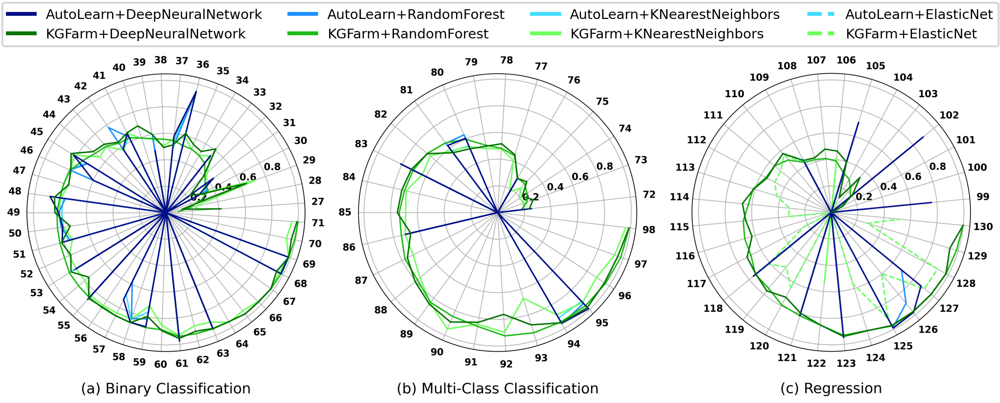

# Experiments

KGFarm is evaluated against state-of-the-art on the <a href="benchmark/README.md">130 open datasets</a>. For data cleaning, we compare it against <a href="https://github.com/HoloClean/holoclean">HoloClean</a> a data cleaning system that uses statistical learning and inference to unify a range of data repairing methods, and <a href="https://github.com/awslabs/datawig">DataWig</a>, an open-source library that uses deep learning feature extractors to perform missing value imputations. For data transformation and feature engineering, we compare it against <a href="https://github.com/saket-maheshwary/AutoLearn">AutoLearn</a>, a regression-based feature learning algorithm that automates feature engineering, and <a href="https://www.ijcai.org/Proceedings/2017/0352.pdf">LFE*</a>, a meta-learning approach that automates data transformation for classification problems.   NOTE: All experiments have been executed on a machine running Ubuntu 20.04.4 LTS, with a 2.40 GHz Intel Core Processor CPU with 16 cores and 88.5 GB of RAM.

## Data Cleaning

KGFarm vs. existing systems on multiple ML tasks on 13 datasets. (a) in the radar diagram, the outer numbers indicate different dataset IDs and the ticks inside the figure denote performance ranges of respective metrics; e.g., 0.2, 0.4, ..., etc. for F1 in each ML task per dataset. For any dataset, the system with the out most curve has the best performance. (b) and (c) the time and memory consumed per system to perform data cleaning on the dataset and train the model. HoloClean and DataWig timeout or exceed the memory budget in several cases. KGFarm outperforms HoloClean and DataWig in most cases with better scalability in terms of time and memory.

## Data Transformation

KGFarm vs. existing systems on multiple ML tasks on 13 datasets. (a) in the radar diagram, the outer numbers indicate different dataset IDs and the ticks inside the figure denote performance ranges of respective metrics, e.g., 0.2, 0.4, ..., etc. for F1 in each ML task per dataset. For any dataset, the system with the out most curve has the best performance. KGFarm outperforms LFE and AutoLearn in most cases. (b) and (c) the time and memory consumed per system to perform data transformation on the dataset and train the model. *F1 scores of LFE are reported by the authors, but its code is not available. KGFarm outperforms Autolearn in terms of time and memory performance.

## Feature Engnieering

KGFarm vs. AutoLean on multiple ML tasks on 104 datasets categorized into (a) Binary Classification Tasks, (b) Multi-Classification Tasks, and (c) Regression Tasks. After feature engineering, we trained using different ML and DL methods as indicated with variant colors. In the radar diagram, the outer numbers indicate different dataset IDs and the ticks inside the figure denote performance ranges of respective metrics. For any dataset, the system with the out most curve has the best performance. KGFarm outperforms AutoLearn in most cases.

(a) Time and (b) Memory consumed for Feature Engineering. KGFarm consumes significantly less time and memory on average than AutoLean.
